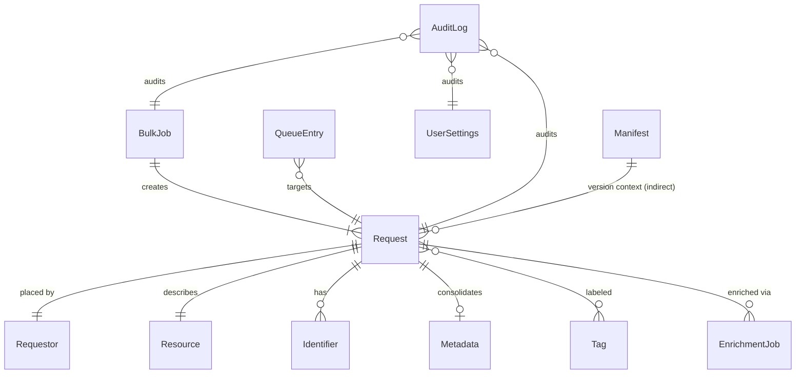

# 📑 SilentStacks v2.1 — Ready to Migrate Model (High-Level)

**Status:** Draft — to become canonical at P0 packaging
**Placement:** `documentation/modeling/Ready_to_Migrate_Model_v2.1.md`

---

## 1. System Overview

SilentStacks v2.1 is a client-side, offline-first ILL management system.
It is composed of three operational layers:

* **UI (index.html)** — presentation, accessibility, help, and request entry.
* **Logic (app.min.js)** — metadata lookups, storage, bulk ops, search, sync.
* **Service Worker (sw\.js)** — offline caching, background queue.

Supporting artifacts: **PDFs (QuickStart, Upkeep, Developer Guide)** + **Manifest (checksums)**.

---

## 2. Entity–Relationship Model



**Entities (object stores in IndexedDB):**

* **Request** — central ILL object; connects Requestor, Resource, Identifiers, Metadata.
* **Requestor** — person placing the request (email = unique).
* **Resource** — bibliographic unit (journal/book/etc.).
* **Identifier** — PMID, DOI, NCT, ISBN, etc.
* **Metadata** — authors, abstract, MeSH terms, journal info.
* **Tag** — workflow labels (priority, status, custom).
* **BulkJob** — represents batch import.
* **EnrichmentJob** — PubMed/CrossRef/CT.gov lookups tied to Request.
* **QueueEntry** — offline actions queued for sync.
* **AuditLog** — records all system/user/AI actions.
* **UserSettings** — theme, contrast, toggles.
* **Manifest** — version contract with checksums & gate passes.

---

## 3. Component Interactions

* **UI ⇄ Logic:**
  UI triggers CRUD ops and enrichments; Logic returns validated objects.

* **Logic ⇄ Storage:**
  IndexedDB stores all entities; localStorage persists lightweight settings.

* **Logic ⇄ External APIs:**
  PubMed ≤2/sec; CrossRef fallback; ClinicalTrials.gov CORS-tested.

* **Logic ⇄ Service Worker:**
  SW manages caching and background sync queues (**QueueEntry**).

* **Docs ⇄ Manifest:**
  QuickStart, Upkeep, Developer Guide must match Manifest version.

---

## 4. Migration State Machine

```
[VERIFY_ARTIFACTS] → [VERIFY_ACCESSIBILITY] → [VERIFY_APIS] → [VERIFY_DOCS] 
   ↓ fail
 [BLOCKED]

[READY_TO_PACKAGE] → [APPROVAL_GATE] → [P0_PACKAGED] → [BETA_RELEASE]
```

* Any failure = **BLOCKED** until resolved.
* Fallbacks provide continuity but **never advance migration state**.

---

## 5. Alignment with Worst Case Scenarios

* Dirty data & bulk recovery → **BulkJob quarantine** (WCS-01).
* Offline failure → **QueueEntry fallback** (WCS-12).
* API overload/timeouts → **EnrichmentJob retry policies** (WCS-20/21/22).
* Governance gaps → **Manifest.passes + AuditLog** (WCS-05/08/09).
* Accessibility failures → **UI contract + AAA checks** (WCS-15).

---

✅ This is the **core modeling artifact**.
At **P0 packaging**, we’ll:

* Drop it into `documentation/modeling/`
* Update **Manifest** paths and doc references
* Mark it **canonical** in the Ready-to-Migrate bundle

---

Do you want me to next **layer in sequence diagrams** (how a request flows from input → enrichment → offline queue → export), or keep the model at this ER/component level for now?
